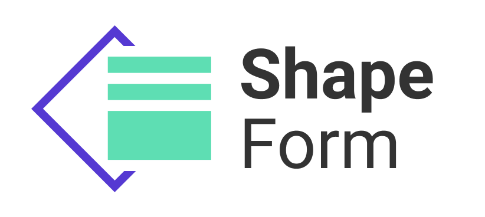
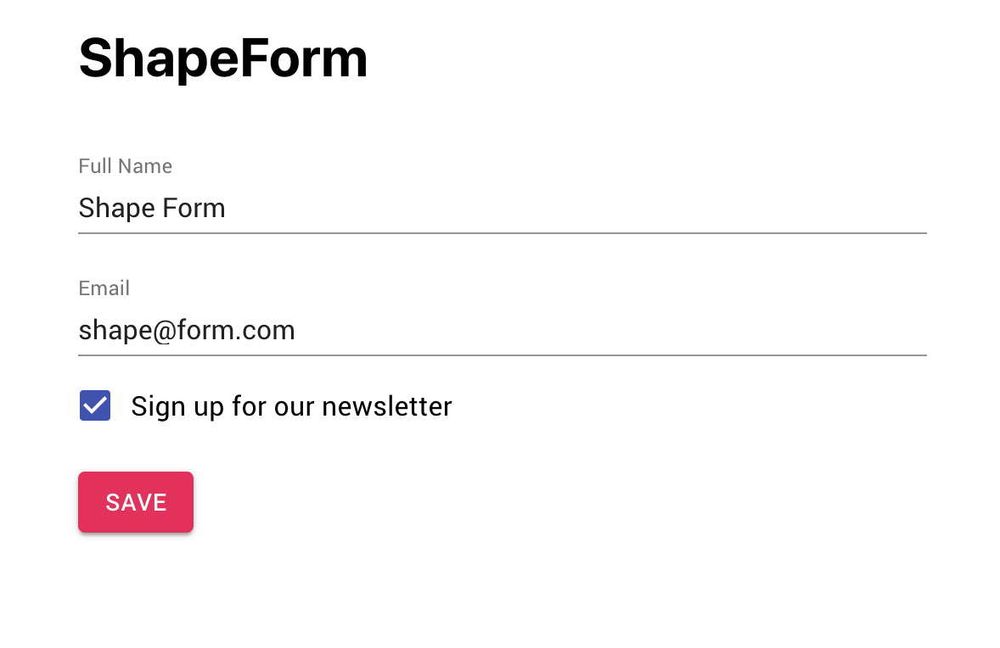

# Shape Form



## Welcome

Thanks for checking out ShapeForm! First announced at the [8/20 Reactadephia Meetup](https://www.meetup.com/Reactadelphia/events/263614474/) this code has been freshly ripped from our [React App](https://app.takeshape.io) and open sourced to the community. Check out [@asprouse](https://github.com/asprouse)'s [presentation](https://shape-form-talk.netlify.com) on how we decided to build our own solution. Give ShapeForm a whirl and let us know what you think or open a PR.

## Installation

```
npm install --save shape-form
```
or
```
yarn add shape-form
```

## Documentation
ShapeForm can be used with or without your own redux store.

### BYO Redux: Setup your store with the shape-form reducer and saga

```es6
// store.js
import {createStore as createReduxStore, applyMiddleware, compose, combineReducers} from 'redux';
import createSagaMiddleware, {END} from 'redux-saga';
import {createFormReducer, formSaga} from 'shape-form';

const sagaMiddleware = createSagaMiddleware();

const enhancer = compose(
  applyMiddleware(sagaMiddleware),
  window.devToolsExtension ? window.devToolsExtension() : f => f
);

const formReducer = combineReducers({
  // ...your reducers
  shapeForm: createFormReducer()
});

export function createStore(initialState) {
  const store = createReduxStore(formReducer, initialState, enhancer);
  sagaMiddleware.run(formSaga);
  store.close = () => store.dispatch(END);
  return store;
}
```

Build your form using JSON schema
```es6
// App.js
import React from 'react';
import {ShapeForm, SubmitButton} from 'shape-form';
import {Provider} from 'react-redux';

import './App.css';

import {createStore} from './store';

const schema = {
  type: "object",
  properties: {
      fullName: {
          title: "Full Name",
          type: "string",
      },
      email: {
          title: "Email",
          type: "string",
          format: "email",
      },
      newsletter: {
          title: "Sign up for our newsletter",
          type: "boolean",
      },
  },
  required: ["fullName", "email"],
};

function App() {
  return (
    <div className="App">
      <Provider store={createStore()}>
        <ShapeForm formName="simple" schema={schema} />
        <SubmitButton formName="simple" />
      </Provider>
    </div>
  );
}

export default App;
```

### Use with the included provider

```es6
// App.js
import React from 'react';
import {ShapeFormProvider, ShapeForm, SubmitButton} from 'shape-form';

import './App.css';

const schema = {
  type: "object",
  properties: {
      fullName: {
          title: "Full Name",
          type: "string",
      },
      email: {
          title: "Email",
          type: "string",
          format: "email",
      },
      newsletter: {
          title: "Sign up for our newsletter",
          type: "boolean",
      },
  },
  required: ["fullName", "email"],
};

function App() {
  return (
    <div className="App">
      <h1>ShapeForm</h1>
      <ShapeFormProvider>
        <ShapeForm formName="simple" schema={schema} />
        <br />
        <SubmitButton formName="simple" />
      </ShapeFormProvider>
    </div>
  );
}

export default App;
```



## Roadmap
- ES6 -> TypeScript 
- Move Material UI dependency into it's own widget package
- Switch from Immutable.js to immer
- Upgrade React DnD
- Convert Redux Saga to a standalone middleware
- Better support non-Redux users
- Explore BYO JSON Schema validation
- Custom field serialization/deserialization
